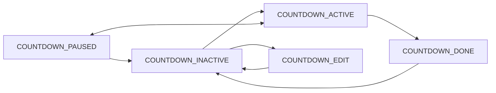

# Countdown:
The countdown feature is a simple egg timer implementation that can allow our clock to count down from
a user set value. When the count reaches zero something will happen!

The countdown can be paused mid-flow or stopped. How we pause or stop it isn't decided yet and depends on the input interface.

## State diagram for countdown:
We can model all input responses as state changes in a state machine,



And the edit responses in another state machine:

```mermaid
flowchart LR
EDIT_HOURS ->
EDIT_MINUTES -> 
EDIT_SECONDS ->
EDIT_INACTIVE ->
EDIT_HOURS
```
We can decide whether this edit state machine can be exited early (IE if EDIT_INACTIVE is connected to each other choice)
or if a user has to go through all states to arrive at EDIT_INACTIVE again and exit the edit mode.
