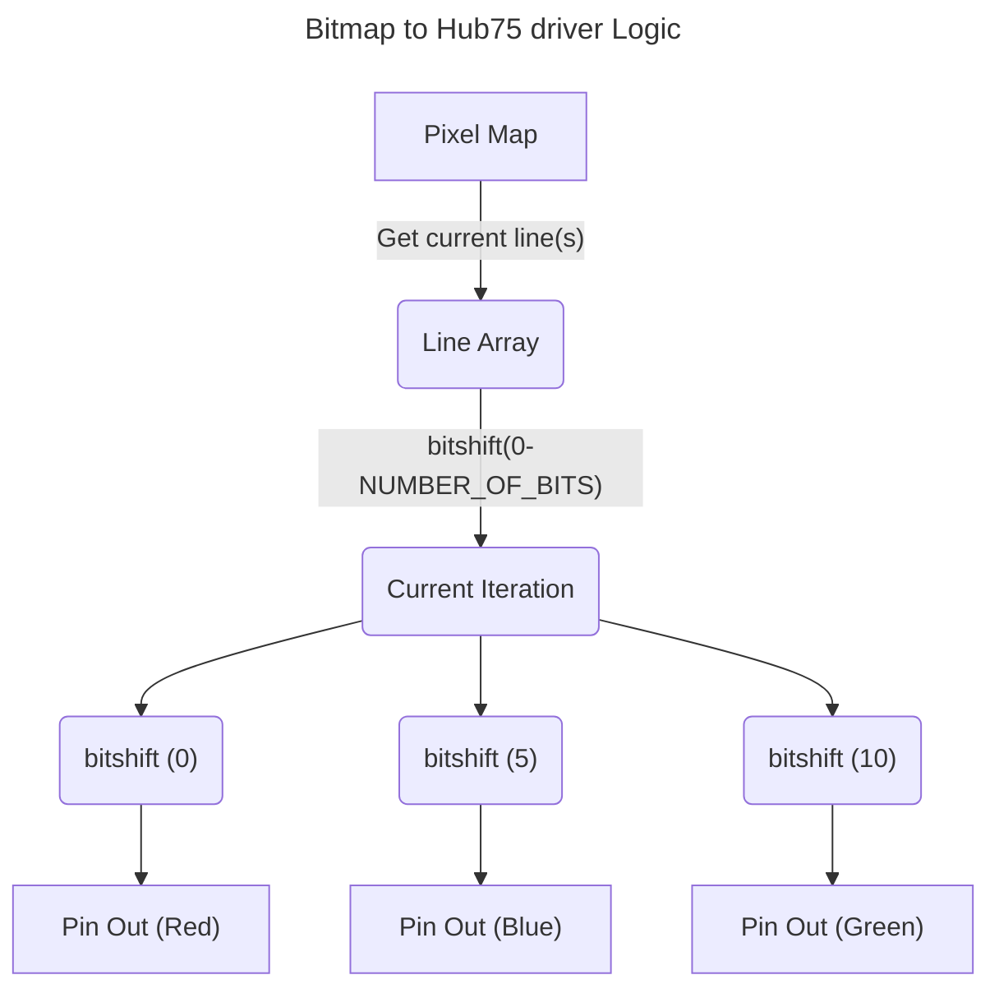

# Display driver Notes:

The display is one of the main parts of our system. A 64x32 LCD display with a HUB75 input. I want to practice some low-level coding, so I'm going to write the driver for the HUB75 board myself. There are more sturdy drivers online for this kind of screen input. (you can find a github repository in the link below:)

How Our Bitmap Is Stored:
---
The bitmap is stored in memory as an array of 16-bit numbers. We can store our three colours in a 16-bit array by separating each 16-bit number into three segments for red, blue, and green values. Below is a table showing how each number is divided into segments. This could be overkill so I might change it!

bits|green|blue |red  |remainder
----|-----|-----|-----|---
5   |GGGGG|BBBBB|RRRRR|.
4   |GGGG.|BBBB.|RRRR.|.
3   |GGG..|BBB..|RRR..|.
2   |GG...|BB...|RR...|.
1   |G....|B....|R....|.

Each G represents an iteration. Darker colours are lit up for fewer iterations, while as lighter colours are lit up for more.

to map this to the HUB75 board, we need to separate out different colours and different iterations. Im using bitshifting for both of these operations.


Ive written the coding logic for a single row here in pseudocode based off python:

```python3
iteration_mask = ob1000010000100000
i = 5
for entry in row:

    mask = bitshift_left(iteration_mask, i)                
    masked_entry = entry and mask # This just removes everything that isnt important.

    # Find colours
    red = bitshift_right(entry, i)
    green = bitshift_right(entry, i + 5)
    blue = bitshift_right(entry, i + 10)
    
    # set the colour pins.
    set_pin(RED_PIN, red)
    set_pin(GREEN_PIN, green)
    set_pin(BLUE_PIN, blue)
    
    # toggle the display clock.
    set_pin(DISPLAY_CLOCK, 1)
    set_pin(DISPLAY_CLOCK, 0)
set_pin(1)
    i -+ 1

```

This approach minimisises the amount of space needed with only a slight hit to processing time. Bitshifts are very fast operations, and we only need to do 4. This saves us 2x memory in our RAM compared to saving 3 -bit numbers, This means that our double buffer approach should be just as memory efficient! (more on that later.)

We will need a way to map from common 8-bit colour spaces down to 5-bit or below using C, but that should be fairly easy!

The basic layout of the HUB75 port:
---
The Hub75 port displays one row of LEDs at a time. you can see this shown graphically below.

Questions: 
- **how do you get to the next line? -**  Once you've pulled latch high, You can select a new line.
- **How does the buffer for each line fill up?** -  bit by bit: IE I select a row, then send 0xFFFFFFFF out and 32 pixels will turn on.
- what does A, B, C and D do in this scenario? - Its the row we want to write to. We'll usually increment this

Take the following example with a simplified 8X4 screen: We want to select the first row of our screen. To do this, we need to set the `ABCD` pins to `0000`. Then we want to write our  pattern out to the screen:

░ ░ ░ ░ ░ ░ ░ ░
░ ░ ░ █ █ ░ ░ ░
░ ░ ░ █ █ ░ ░ ░
░ ░ ░ ░ ░ ░ ░ ░

We first need to select the second row of the screen: to do this, we can set the  `ABCD` inputs to `0001`. We pull the latch low to lock in our choice of row. After that, we send out our bits for that row: `00011000`. This will light up the pixels in columns 4 and 5. Next, we need to unlatch and then enable our display, so we pull the `latch` high, and toggle the `OutputEnable` pin to high. This will turn the pixels on and display our line.

The 32x64 screen is more complex. It has some doubling, where a register controls more than one line of pixels, as shown in the diagram below. In the example below, you would need to send 16 bits out to display something on both lines.

```
░ ░ ░ ░ ░ ░ ░ ░
█ █ █ █ █ █ █ █
░ ░ ░ ░ ░ ░ ░ ░
█ █ █ █ █ █ █ █
```

To get the doubling to work correctly, I will need to figure out the order. Some of the resources I have read state that this pattern can be complex: Ideally, it would be set up like this:
```markdown
░ ░ ░ ░ ░ ░ ░ ░
1 2 3 4 5 6 7 8
░ ░ ░ ░ ░ ░ ░ ░
9 a b c d e f g

```

However, some resources I have read suggest the pattern might look more like this instead:

```Markdown
░ ░ ░ ░ ░ ░ ░ ░
1 2 3 4 d e f g
░ ░ ░ ░ ░ ░ ░ ░
5 6 7 8 9 a b c

```

With a "break" halfway through the first line.

To test this, I need to send a pattern out that repeats in a way that would be noticable if it wasnt continous: I could use a pattern with 32 bits of red, then blue, then green then unlit LEDs for this.

Interfacing between the Port and the Bitmap:
---

We have a bitmap and the port interface. Now, we need to design a driver that takes in a pixel map and turns the display pins on and off in the correct order to display an image.

HUB75 pixel screens are only capable of turning one row of LEDs on at a time. This means that we have to cycle through rows quickly to display an image. There is also the added complication of doubling, or quartering the lines. Each line is made up of 64 pixels, so a doubled line would need to drive 128 pixels, and a quadrupled line would need to display 256 pixels. Thats 2 and 4 64 bit numbers respectively.


Pixel Map --> Driver --> Pin Out Signals


## Links that could be useful:

https://github.com/mrcodetastic/ESP32-HUB75-MatrixPanel-DMA
https://news.sparkfun.com/2650
