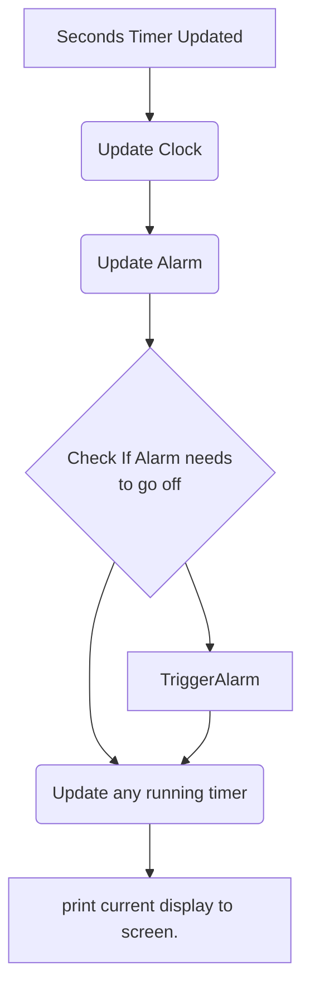
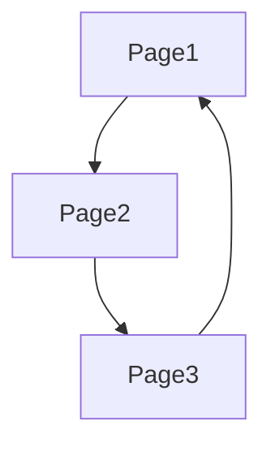

# Software Notes:

The software is designed around a MVC design, with

# Pages:
Each function of the clock (alarm/timer/clock display) will be represented in code by a "page." This page will hold state variables and function pointers to specific functions shared by all pages. Pages are essentially C classes, with data and methods bound to them.

Pages have three main responsibilities:
- Pages will contain the function that draws the current view.
- Pages will determine what data changes when specific inputs occur.
- Pages will determine what happens every time a second has elapsed.

A page has three main components:

- PageViewUpdater: This handles redrawing the view whenever the page information changes.
- PageTimerUpdater: This handles changing the page whenever a second has passes.
- PageInputUpdater: This handles inputs that change the pages model.

Function pointers will handle these. This allows us to create pages that can be swapped easily.

# Timer Updates:
Every time a second passes, the timer update function is called. This function allows us to update/perform checks on any pages that we need to update every second.

The timer update might look like this:


In this flowchart, updating the alarm and triggering the alarm will be handled by the PageTimerUpdater associated with the Alarm.

As you can see, the update timer function is also in charge of updating the screen. 

To change between pages, we need a state machine that can circle through pages when a button is pressed.



One page can only lead to the next page, so we can access pages using a simple array and indexing solution to implement our state machine.

If we want more complex state machine interaction, we might have to implement a linked list for each page instead.
Each page will have the following structure:

```C
struct Page{
  void (*timer_update_fn)();
  void (*input_update_fn)();
  void (*display_fn)();
}
```

Everything the page interacts with will have to interact with static peices of memory, as
