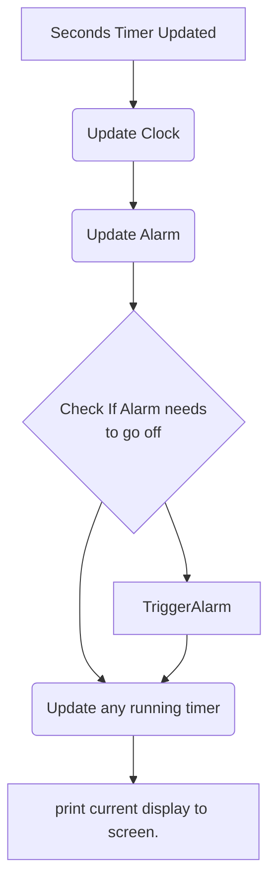
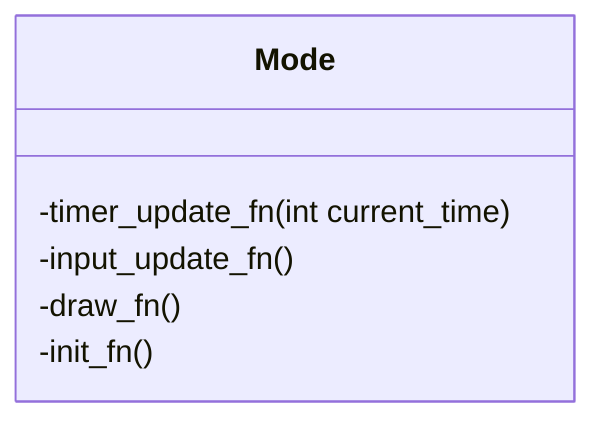
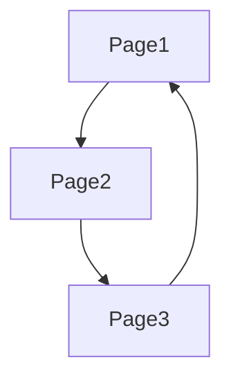

# Software Notes:

This document goes over the software implementation for the clock.

# Timer Updates:
Every time a second passes, the timer update function is called. This function allows us to update/perform checks on any Modes that we need to update every second.

The timer update might look like this:


# Modes:

Each clock function (alarm/timer/clock display) will be represented in code by a "Mode." This Mode will hold state variables and function pointers for specific functions. We are creating a class here – without inheritance and with limited polymorphism.

Modes have three responsibilities:

- Modes will contain a function that draws the current view.
- Modes will determine what data changes when specific inputs occur.
- Modes will determine what happens every time a second has elapsed.

A Mode has three main components:

- PageViewUpdater: This handles redrawing the view whenever the Mode information changes.
- PageTimerUpdater: This handles changing the Mode whenever the clock display updates.
- PageInputUpdater: This handles inputs that change the Mode's model.

We can model this with a UML diagram like so:



Modes shouldn't have internal data, only function pointers (and maybe next variables for state machines.)

Function pointers will handle these. This allows us to create Modes that can be swapped easily.

All modes will be held in the CurrentModeSelector state machine. This will allow us to add modes easily without large case statements.

In this flowchart, updating the alarm and triggering the alarm will be handled by the PageTimerUpdater associated with the Alarm.

As you can see, the update timer function is also in charge of updating the screen. 

To change between Modes, we need a state machine that can circle through Modes when a button is pressed.



One Mode can only lead to the next Mode, so we can access Modes using a simple array and indexing solution to implement our state machine.

If we want more complex state machine interaction, we might have to implement a linked list for each Mode instead.
Each Mode will have the following structure:

```C
struct Mode{
  void (*timer_update_fn)();
  void (*input_update_fn)();
  void (*display_fn)();
}
```
## Clock Mode:

### Timer_update_fn
The clock mode just exists to update the current time display. This is our simplest mode as we dont need to include any logic within `timer_update_fn`, as the time is read on every loop anyway. I might need to move time string into here (although Im also planning to use the time string within the alarm Mode)

### Draw 
