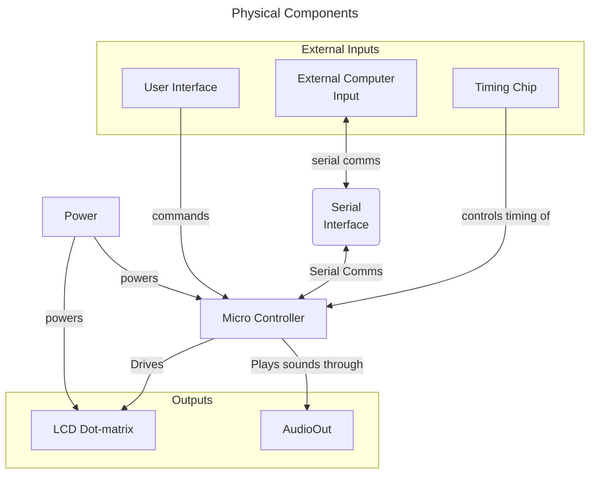
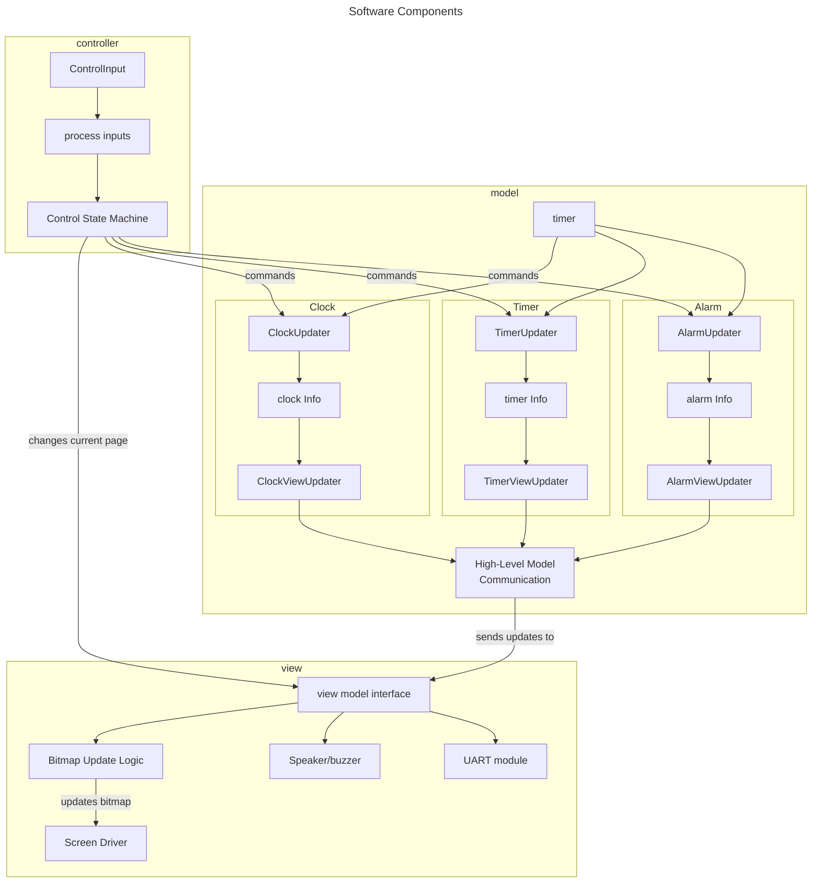

# Embdedded Clock/Timer Project:

I have an old bitmap screen that I have meant to do something with for ages. I have time between applying for jobs, so I might as well do it now! I want to implement the following functionality as an MVP but keep the project extendable and programmable. Eventually, I want more internet-connected features, like a weather screen or a notification bar. Maybe I could use embedded Alexa for this (but that would need a big upgrade).

At the moment, this code is fairly abstract. I haven't firmed any components apart from the screen, and I'm still deciding between using an ESP32 or a Pi Pico for this project.

You can find more documentation in the [docs](docs) folder.

## MVP functionality: 
To display the current time and switch to a timer setting when needed, the clock will need the following features:

- **Accurate timekeeping**: either through internet checking or an external timing chip designed for this functionality.
- **Multiple pages:** The user must be able to switch between clock, alarm, and timer modes. This means our view must have multiple "pages". The information displayed on the screen will change depending on which page we are on.
- **Easily Readable Text:** We will have to develop a way of storing characters or sprites for text. At the moment they are just stored as arrays within the code.
- **Intuitive UI:** The model will have to have intuitive ways of interacting with our clock, changing the alarm duration, timer time and other variables. This will be included in the physical design process.

# Hardware Structure:

At a hardware level, there are only 6 main components/subsystems:

- **Battery/Power supply:** This provides power to our system. Need to work out what voltage the screen will take.
- **Microcontroller:** this handles logic, inputs and outputs
- **User interface for the embedded system**: Physical controls that the end user can use to interact with the device.
- **Serial Port/Bluetooth connectivity:** We attach the screen to our computer.
- **LCD Dotmatrix screen:** This is what will display the time, 
- **Speaker/Buzzer:** for playing sounds.

## Inputs and Outputs:

Our controller has three inputs: 

- **Timing Chip**: This will be a more accurate timer than the built-in ESP32 clock
- **External Serial Input:** This will read incoming messages from a computer/another chip.
- **User Interface:** This will be how an end user interacts with the device, it could be buttons, knobs or some other form of input, but I'm keeping it abstract for now.

The system also has **three main outputs**:

- **LCD dot-matrix screen**: This will be our display.
- **Audio Out:** This could be a buzzer, a speaker or an analog VCA circuit. I havent decided yet. Probably a buzzer in the first implementation.
- **External Serial Output**: This is how we print error messages and information to send back to the computer. It is not used by the end-user.

# Software Design

The software on the microcontroller is designed to be modular. Different functions are seperated out into pages, and pages are designed to interface with the rest of the software as little as possible. For example, a simple clock might have four pages:

- **Alarm:** This sets and processes the alarm logic.
- **Timer:** A timer that counts up from the start.
- **Clock:** A standard clock screen.

All these pages need to react differently to button presses, and send different info out to the screen, but we only need to send one thing out: The current display information. We only need button presses and timer information to come in.

# Pages:
Each function of the clock is contained in a "page". This holds various callbacks that can update the logic behind each function, draw the page to the screen or accept some input. These are all designed to be high level functions.

For an example, lets take a timer function. This will have a view, which prints the remaining amount of time that the timer has to run, a logic component that allows the timer to count up, and some inputs so that the user can stop and reset the timer. All of this functionality will be contained in the following three functions:

- **draw_fn()**: This is responsible for displaying the timer on the screen. It will take some information about the timer, and use that to update the screen_bitmap.
- **Input update_fn(int input)**: This function handles how each page will respond to an input. We want the user to press one button to start and stop the timer, and another to reset it, one button will trigger a 1, while another will be 2. 0 means no input.
- **timer_update_function(time_string)** This takes in the time, then updates any variables that need updating. At the moment this is a time string, but we need to change it to a raw time at some point.22

# TODOS:

- [ ] Get terminal input to work to allow switching/refreshing of pages.
- [ ] Refactor main to remove Mac/Unix-specific calls.
- [ ] Refactor get_current_time returns a raw time that is processed within time.h.
- [ ] Design pages for timer function.
  - [ ] Design logic for timer.
  - [ ] Design views for timer (probably not very different to clock.c)
  - [ ] Design control interface for timer
- [ ] Design pages for alarm function.
  - [ ] Design logic for alarm.
  - [ ] Design views for alarm (probably not very different to clock.c)
  - [ ] Design control interface for alarm
