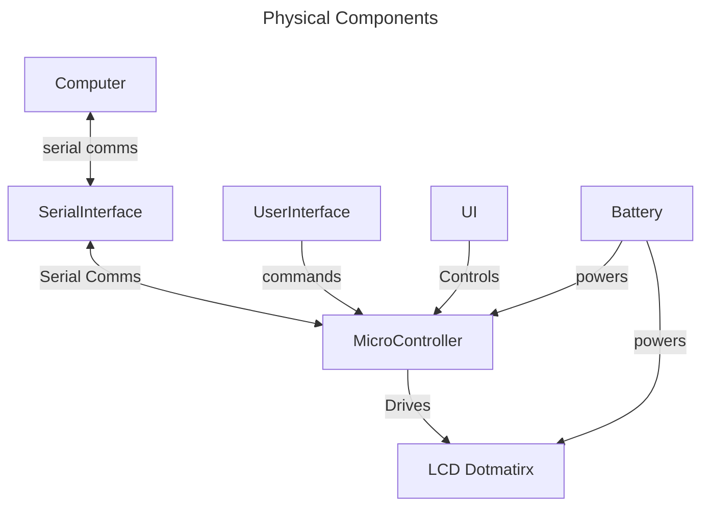
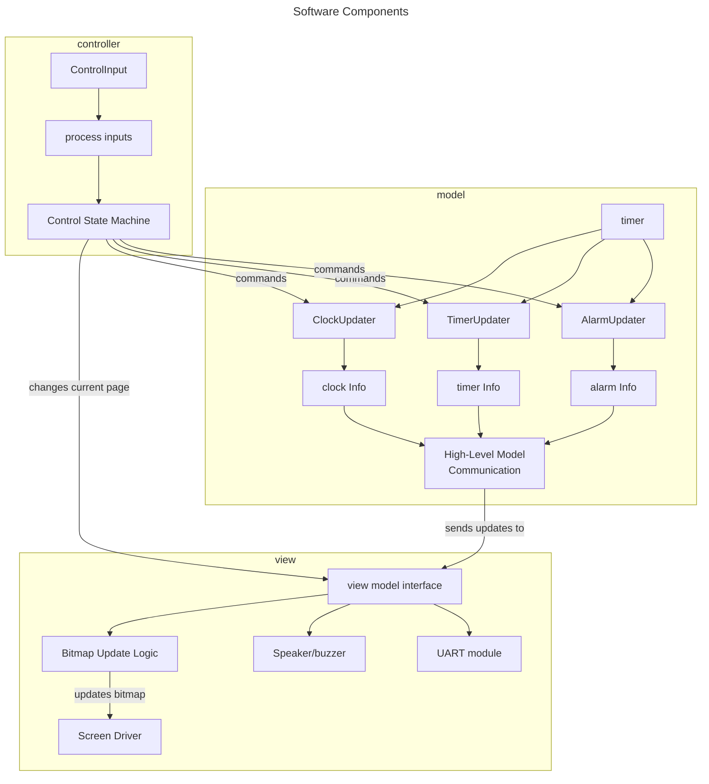

# Embdedded Clock/Timer Project:

I have an old bitmap screen lying around, which I have meant to do something with for ages. I have some time between applying for jobs, so I might as well do it now! I want to implement the following functionality as an MVP, but keep the project extendable and programmable. Eventually I want more internet connected features, like a weather screen or a notification bar. Maybe I could use embedded alexa for this (but that would need a big upgrade.)

At the moment, this code is fairly abstract. I haven't firmed any components apart from the screen, and I'm still deciding between using an ESP32 or a Pi Pico for this project.

## MVP functionality: 
To display the current time and switch to a timer setting when needed, the clock will need the following features:

- **Accurate timekeeping**: either through internet checking or an external timing chip designed for this functionality.
- **Multiple pages:** The user must be able to switch between clock, alarm, and timer modes. This means our view must have multiple "pages". The information displayed on the screen will change depending on which page we are on.
- **Easily Readable Text:** We will have to develop a way of storing characters or sprites for text. At the moment they are just stored as arrays within the code.
- **Intuitive UI:** The model will have to have intuitive ways of interacting with our clock, changing the alarm duration, timer time and other variables. This will be included in the physical design process.

# Basic Structure:

At a hardware level, there are only 5 main components:

- **Battery/Power supply:** This provides power to our system. Need to work out what voltage the screen will take.
- **microcontroller:** this handles logic, inputs and outputs
- **User interface for the embedded system**: These are any buttons that may be used on the clock to control features.
- **Serial Port/Bluetooth connectivity:** This is how we attach the screen to our computer.
- **LCD Dotmatirx screen:** This is what will display the time, 
- **Speaker/Buzzer:** for playing sounds, this will be implemented last I think!

At a software level, I have separated components by using an MVC structure. This means that separate view and control modules can be written for my dev environment (on the computer) and for the embedded environment without introducing breaking changes. This might be overkill for a personal project, but it could be useful if I want to use a different screen at some point!

This structure diagram is simplifed and doesnt include any ISRs, but you can just think of the timer updater block as including any timekeeping we need to do.

## Next Steps:
Decide on which board to use - either Pi Pico or ESP32.
Find the 
